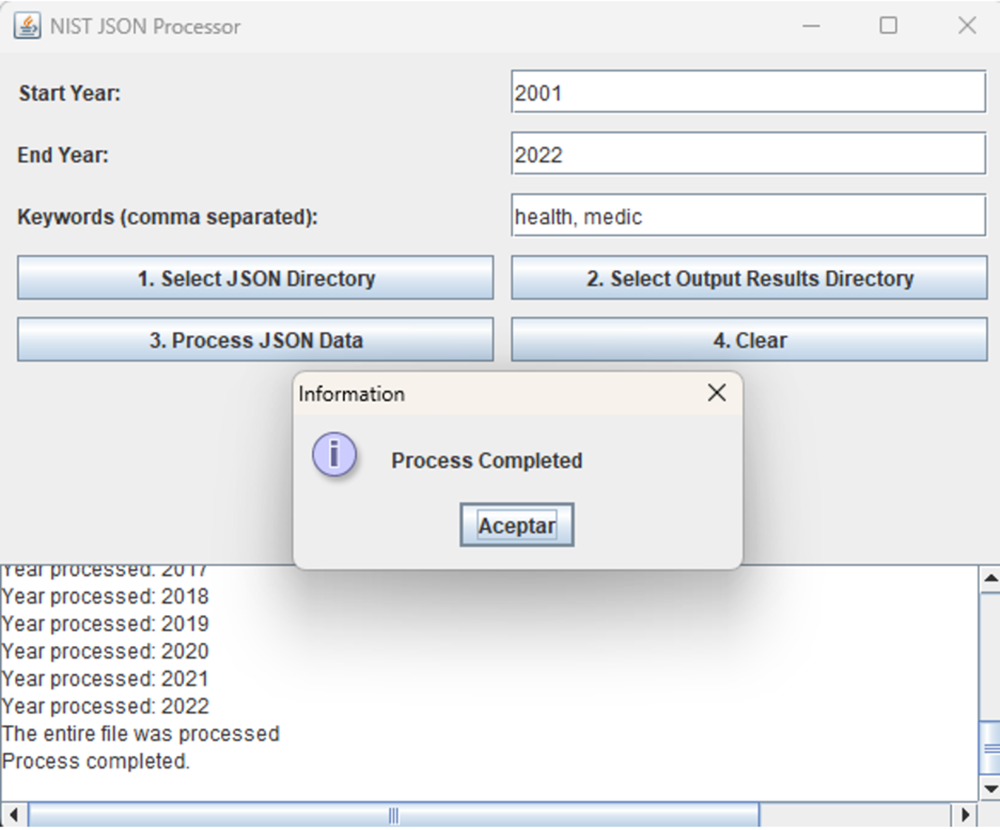
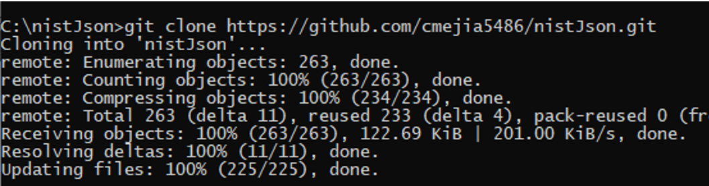
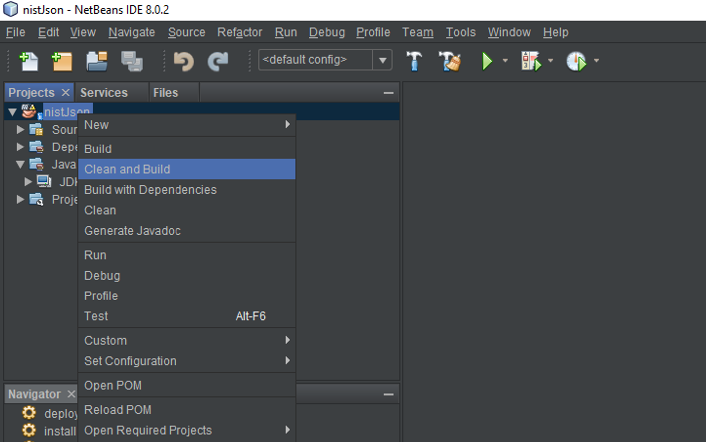

# NistJson: Open-Source Tool for JSON Processing and Software Vulnerabilities Analysis Based on NIST NVD

## Description
NistJson represents a Java console-oriented application meticulously designed for processing and extracting information relevant to software vulnerabilities. It employs the Jackson library to facilitate the processing and analysis of JSON-formatted data, which provides it with several significant advantages: (i) superior efficiency in managing large data sets, (ii) sophisticated search functionalities characterized by fully parameterizable criteria, (iii) adaptability and expandability attributable to its modular architecture and object-oriented programming paradigm, (iv) ease of use and modifiability for both experienced and novice programmers, and (v) reliability and accuracy ensuring research reproducibility by standardizing execution parameters and input data.

## Key Features

- **Ease of Use and Customization**: NistJson has been meticulously developed to be accessible to both seasoned developers and novice programmers, presenting an intuitive interface alongside a customizable parsing methodology. Users can easily modify and tailor the tool to their specific requirements, thereby rendering it highly versatile for an extensive array of applications.
- **Superior Efficiency and Scalable Data Handling**: The tool demonstrates exceptional proficiency in managing substantial datasets and efficiently processing JSON inputs, guaranteeing optimal performance even in extensive data volumes. Its scalable architecture accommodates expanding datasets without sacrificing speed or reliability.
- **Modular and Expandable Architecture**: Engineered with a modular design and principles of object-oriented programming, NistJson exhibits high adaptability and extensibility, permitting users to incorporate new features or customize existing functionalities to align with specific requirements.
- **Sophisticated Search and Advanced Data Enrichment**: NistJson offers advanced search capabilities characterized by fully parameterizable criteria, thereby enabling precise filtering and retrieval of data. Additionally, users are empowered to augment extracted vulnerability data with supplementary metadata, enriching the depth of analysis and insights.
- **Research Reproducibility and Reliability**: By standardizing execution parameters and input data, the tool guarantees reliability and accuracy, facilitating the reproducibility of research endeavors and ensuring consistency of results across diverse studies.
- **Efficient JSON Processing with Jackson**: NistJson capitalizes on the Jackson library to proficiently parse and process large volumes of JSON data, such as that sourced from the National Vulnerability Database (NVD), ensuring optimal performance and data integrity.
- **CSV Export and Cross-Platform Compatibility**: The tool facilitates the straightforward export of processed data into CSV format for seamless integration with data analysis tools. As a Java-based application, it boasts cross-platform compatibility, enabling uninterrupted use across various operating systems without necessitating additional dependencies or configurations.

## Installation of NetBeans Ide 8.0.2

1. Run the NetBeans Ide 8.0.2 installer and press the "Customize..." button:
   

  

2. Enable plugins for java usage and click on “Ok” button:

  

3. Click on next button:

  

 4. Read and accept the terms of use, then, click on “Next” button 
    

  

 5. Don’t install Junit, and click on “Next” button 
    

  

 6. Select the installation path and click on Next button 
    

  

  
 7. Click on install button 
    

  

 8. Click on the Finish button 
    

  

## Preparing java project

 1. Select the directory to which the repository will be cloned:  
    

  

    
 2. Run the command git clone https://github.com/cmejia5486/nistJson.git. 
    

  

 

 3. Visit the NIST NVD URL https://nvd.nist.gov/vuln/data-feeds, download the data feeds in Json format and place them in the "JsonData" directory of the project. 
    

  

 

 4. Open the project in the previously installed NetBeans Ide 8.0.2 and click on clean and build option.
    

  

 

## Setting the keywords

 1. Inside the nist.main package go to the main.class class and in the list of strings you can add as many "keys" as you consider necessary, for the particular example "HEALTH" and "MEDIC" have been added.
    

  

 

## 6.	Running the tool

 1. Right click on the project and press the "Run" button, this will process the files in JSON format and generate the processed data as output in CVS format.
    

  

 

 2. At the end of the execution of the tool, an output like the one presented will be generated. 

  

 

 3. The generated files will be found under the directory:  ../nistJson/results. 

  

 

 4. Right click over the VulnerabilityDataExporter java class and select “RunFile option

  

 

 5. Once the execution is finished without exceptions, it will issue the information message about the files with the generated metrics

  

 

 6. The generated files will be found under the directory:  ../nistJson/spss

## Demo
[Demo video](https://youtu.be/LmwGtRXYmxI?si=MOAlIm66rHSoARXy)

## Technical Documentation Manual
[JavaDoc](target/reports/apidocs/index.html)

## **License:**
This project is licensed under the GNU General Public License Version 3 - see the [LICENSE](https://github.com/cmejia5486/nistJson/blob/main/LICENSE) file for details. 

## **Contact:**
**Carlos M. Mejía-Granda** 

- E-mail: <carlosmichael.mejiag@um.es>
- LinkedIn: [Carlos Mejía Granda](https://www.linkedin.com/in/carlos-mej%C3%ADa-granda-70239910a/).

## **Acknowledgements**

We would like to express our gratitude to the National Institute of Standards and Technology (NIST) National Vulnerability Database (NVD) for providing their data feeds in JSON format, which have been invaluable in our experiments and are included as data samples in this repository.
